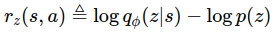

# EDIAYN-PyTorch

While intelligent  creatures can explore their environments and learn useful skills without supervision, many RL algorithms are heavily on the basis that acquiring skills is only achieved via defining them as explicit reward functions to learn.
    
Thus, in order to translate the natural behavior of creatures in learning **diverse** skills to a suitable mathematical formulation, DIAYN (Diversity is All You Need) was proposed for learning useful skills **without any domain-specific reward function**.
    
Instead of the real reward of the environment, DIAYN optimizes the following objective:

  

that _`z`_ is the skill that the agent is learning and, since we desire learned skills to be **as diverse as possible**, _`z`_ is modeled by a Uniform random variable that has the highest standard variation.
    
The above equation simply implies that the reward of any diverse task is equal to measuring how hard recognizing the skill _`z`_ is, given the state _`s`_ that the agent has visited compared to the real distribution over _`z`_ (which is Uniform distribution in DIAYN paper.)   
The bigger rz(s, a) is, the more ambiguous skill _`z`_ is thus, the state _`s`_ should be visited more for task _`z`_ so, the agent finally acquires this skill.

Concurrently to learn rz(s, a), any conventional RL method can be utilized to learn a policy and DIAYN uses SAC.

**In this project I propose an alternative of DIAYN, the EDIAYN algorithm that which is the DIAYN algorithm built on top of evolutionary strategies instead of SAC**

This repository is based on https://github.com/alirezakazemipour/DIAYN-PyTorch.

## Research Poster

Please check the file `waris-radji-e-diayn-poster.pdf` to see the full pdf

## Structure

1. _Brain_ dir consists of the neural network structure and the agent decision-making core.
2. _Common_ consists of minor codes that are common for most RL codes and do auxiliary tasks like logging and... .
3. _*main.py_ is the core module of the code that manages all other parts and makes the agent interact with the environment.

## Reference

1. [_Diversity is All You Need: Learning Skills without a Reward Function_, Eysenbach, 2018](https://arxiv.org/abs/1802.06070)
